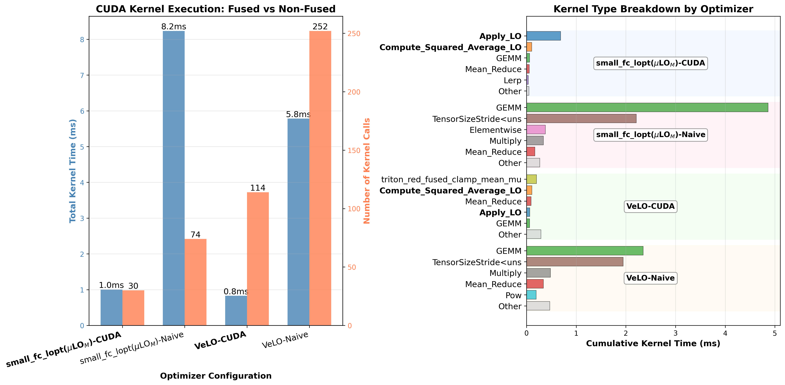

How It Works: CUDA Implementation
==================================

This page provides a detailed technical explanation of PyLO's CUDA implementation.

Overview: The Performance Challenge
----------------------------------

Naive implementations of learned optimizers face a fundamental performance bottleneck. To understand why, let's examine what happens during a single optimizer step.

The Naive Approach
~~~~~~~~~~~~~~~~~

For a parameter tensor of size m × n, a naive PyTorch implementation:

1. **Constructs features:** Creates a tensor of size (m×n) × d_feat where d_feat ≈ 29-39
2. **Computes statistics:** Reduces each feature dimension to compute normalization factors
3. **Normalizes features:** Divides each feature by its normalization factor
4. **Applies MLP:** Evaluates a small neural network for each of the m×n parameters
5. **Applies updates:** Computes and applies the parameter updates

**The problem:** Each of these steps launches separate CUDA kernels, and all intermediate results are materialized in GPU global memory.

This results in optimizer steps that are 10-50× slower than traditional optimizers!

The Performance Profiler View
~~~~~~~~~~~~~~~~~~~~~~~~~~~~

Here's what the CUDA profiler shows for the naive implementation vs CUDA implementation:

PyLO's Solution: Fused CUDA Kernels
----------------------------------

PyLO eliminates the bottleneck by fusing all operations into just **2 CUDA kernels** that carefully manage the GPU memory hierarchy.

The Two-Kernel Architecture
~~~~~~~~~~~~~~~~~~~~~~~~~~

**Kernel 1: Feature Statistics Collection**

Computes normalization statistics without materializing the full feature tensor:

.. code-block:: text

    Input:  gradients, parameters, accumulators (m, v, r, c)
    Output: d_feat normalization statistics (just 39 scalars)
    
    For each parameter element (in parallel):
        1. Load gradient, parameter, accumulators from global memory
        2. Compute features in registers (39 values)
        3. Accumulate feature² in register array
        4. Reduce within warp using shuffle operations
        5. Reduce within block using shared memory
        6. Atomic add to global statistics

**Kernel 2: Feature Construction and MLP Application**

Applies the learned optimizer using the computed statistics:

.. code-block:: text

    Input:  gradients, parameters, accumulators, statistics
    Output: updated parameters
    
    Load statistics into shared memory (broadcast to all threads)
    
    For each parameter element (in parallel):
        1. Load gradient, parameter, accumulators from global memory
        2. Compute features in registers (39 values)
        3. Normalize using statistics from shared memory
        4. Evaluate MLP in registers:
           - hidden = ReLU(W1 × features + b1)
           - hidden = ReLU(W2 × hidden + b2)
           - direction, magnitude = W3 × hidden + b3
        5. Compute update: direction × exp(magnitude × α) × β
        6. Write updated parameter to global memory

All intermediate values stay in registers and nothing materialized to global memory!

Performance Results
~~~~~~~~~~~~~~~~~

The fused implementation delivers dramatic speedups:

.. code-block:: text

    ViT-B/16 (batch size 32):
    ├─ Naive small_fc_lopt: 756.80 ms/step
    ├─ CUDA small_fc_lopt:  99.59 ms/step  → 86% reduction
    ├─ Naive VeLO:          585.11 ms/step
    └─ CUDA VeLO:          113.58 ms/step  → 80% reduction
    
    GPT-2 355M (batch size 4, seq length 1024):
    ├─ Naive small_fc_lopt: 2872.17 ms/step
    ├─ CUDA small_fc_lopt:   319.14 ms/step → 88% reduction
    ├─ Naive VeLO:          2378.93 ms/step
    └─ CUDA VeLO:            284.37 ms/step → 88% reduction

Detailed Implementation
----------------------

Kernel 1: Feature Statistics Collection
~~~~~~~~~~~~~~~~~~~~~~~~~~~~~~~~~~~~~~

Here's the high-level algorithm for Kernel 1:

.. code-block:: cuda

    __global__ void compute_feature_statistics(
        const float* __restrict__ grad,
        const float* __restrict__ param,
        const float* __restrict__ momentum,
        const float* __restrict__ second_moment,
        const float* __restrict__ row_factors,
        const float* __restrict__ col_factors,
        float* __restrict__ global_stats,
        int m, int n, int step)
    {
        // Thread-local accumulator in registers
        float thread_stats[D_FEAT] = {0.0f};
        
        // Grid-stride loop over all parameters
        for (int idx = blockIdx.x * blockDim.x + threadIdx.x; 
             idx < m * n; 
             idx += blockDim.x * gridDim.x)
        {
            // Load inputs from global memory
            float g = grad[idx];
            float p = param[idx];
            float mv = momentum[idx];
            float v = second_moment[idx];
            // ... load row/col factors ...
            
            // Compute all features in registers
            float features[D_FEAT];
            compute_features(features, g, p, mv, v, ...);
            
            // Accumulate feature²
            #pragma unroll
            for (int i = 0; i < D_FEAT; ++i) {
                thread_stats[i] += features[i] * features[i];
            }
        }
        
        // Reduce within warp using shuffle
        #pragma unroll
        for (int i = 0; i < D_FEAT; ++i) {
            for (int offset = 16; offset > 0; offset /= 2) {
                thread_stats[i] += __shfl_down_sync(0xffffffff, 
                                                     thread_stats[i], 
                                                     offset);
            }
        }
        
        // Write warp results to shared memory
        __shared__ float smem[32][D_FEAT];
        if (threadIdx.x % 32 == 0) {
            int warp_id = threadIdx.x / 32;
            #pragma unroll
            for (int i = 0; i < D_FEAT; ++i) {
                smem[warp_id][i] = thread_stats[i];
            }
        }
        __syncthreads();
        
        // Final reduction and atomic add to global memory
        if (threadIdx.x < D_FEAT) {
            float sum = 0.0f;
            for (int w = 0; w < blockDim.x / 32; ++w) {
                sum += smem[w][threadIdx.x];
            }
            atomicAdd(&global_stats[threadIdx.x], sum);
        }
    }

Kernel 2: Fused Feature Construction and MLP Application
~~~~~~~~~~~~~~~~~~~~~~~~~~~~~~~~~~~~~~~~~~~~~~~~~~~~~~~

Here's the high-level algorithm for Kernel 2:

.. code-block:: cuda

    __global__ void apply_learned_optimizer(
        float* __restrict__ param,
        const float* __restrict__ grad,
        const float* __restrict__ momentum,
        const float* __restrict__ second_moment,
        const float* __restrict__ row_factors,
        const float* __restrict__ col_factors,
        const float* __restrict__ global_stats,
        const float* __restrict__ mlp_weights,
        int m, int n, int step)
    {
        // Load normalization statistics to shared memory
        __shared__ float norm_stats[D_FEAT];
        if (threadIdx.x < D_FEAT) {
            float stat = global_stats[threadIdx.x];
            norm_stats[threadIdx.x] = rsqrtf(stat / (m * n) + 1e-8f);
        }
        __syncthreads();
        
        // Grid-stride loop over all parameters
        for (int idx = blockIdx.x * blockDim.x + threadIdx.x; 
             idx < m * n; 
             idx += blockDim.x * gridDim.x)
        {
            // Load inputs from global memory
            float g = grad[idx];
            float p = param[idx];
            float mv = momentum[idx];
            float v = second_moment[idx];
            // ... load row/col factors ...
            
            // Compute features in registers
            float features[D_FEAT];
            compute_features(features, g, p, mv, v, ...);
            
            // Normalize features using shared memory broadcast
            #pragma unroll
            for (int i = 0; i < D_FEAT; ++i) {
                features[i] *= norm_stats[i];
            }
            
            // Inline MLP evaluation (all in registers)
            float hidden1[HIDDEN_DIM];
            mlp_layer(hidden1, features, mlp_weights, 0);  // Layer 1
            relu(hidden1, HIDDEN_DIM);
            
            float hidden2[HIDDEN_DIM];
            mlp_layer(hidden2, hidden1, mlp_weights, 1);   // Layer 2
            relu(hidden2, HIDDEN_DIM);
            
            float output[2];  // [direction, magnitude]
            mlp_layer(output, hidden2, mlp_weights, 2);    // Layer 3
            
            // Compute update
            float direction = output[0];
            float magnitude = output[1];
            float update = direction * expf(magnitude * 0.01f) * 0.01f;
            
            // Write updated parameter to global memory
            param[idx] = p - update;
        }
    }
